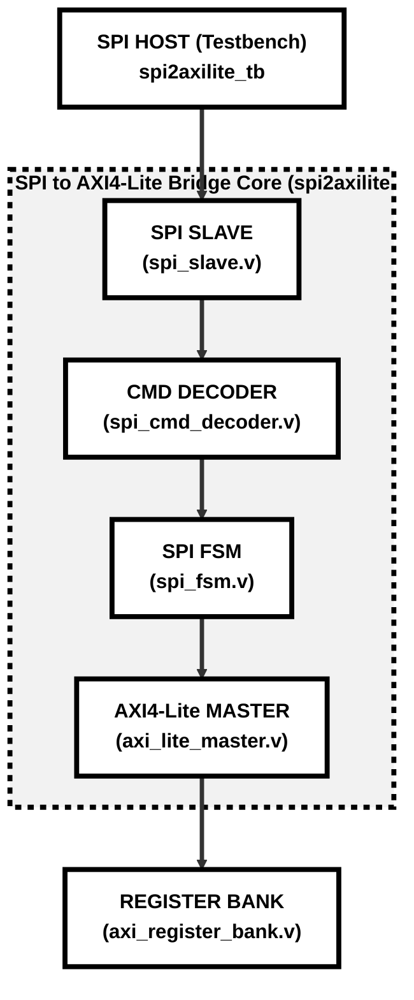

# Synthesizable SPI to AXI4-Lite Protocol Bridge (Verilog HDL)

This repository contains a modular, fully synthesizable, and simulation-verified **SPI to AXI4-Lite Protocol Bridge** implemented in standard Verilog HDL. This hardware design is engineered as a professional digital transceiver portfolio piece and serves as a formal evaluation submission for the Zoho Technical Engineering Board.

---

## 1. Project Overview

In modern System-on-Chip (SoC) architectures, low-speed external controllers (like microcontrollers or sensors) frequently need to configure high-speed internal FPGA logic. The **SPI to AXI4-Lite Bridge** acts as a cycle-accurate hardware translator. It isolates the slow external serial SPI clock domain from the internal parallel high-speed AXI4-Lite interconnect, enabling synchronous, memory-mapped register reads and writes over standard AMBA channels.

### Key Hardware Features
* **SPI Mode 0 Support:** Decodes standard 4-wire SPI (`mosi`, `miso`, `sclk`, `cs_n`) operating with active-low chip select.
* **Metastability Protection:** Input pins are double-synchronized to the fast system clock (`clk`) immediately at the input boundaries.
* **Rigid 24-bit Packet Framing:** Transfers commands using a simple sequential protocol: `[8-bit Command] -> [8-bit Address] -> [8-bit Data]`.
* **Standard AMBA AXI4-Lite Master:** Drives standard address, data, and response valid-ready handshakes.
* **Decoupled Module Design:** Decouples serial shifting, combinatorial decoding, state machine routing, and bus handshakes for easier timing closure.
* **Presentation Ready:** Pre-configured ModelSim scripts organize waveforms with visual dividers, hexadecimal radices, and ASCII state naming.

---

## 2. Architecture & Design Hierarchy

The design is organized into cleanly partitioned submodules under the top-level wrapper `spi2axilite`.



### Submodule Descriptions
1. **`spi_slave` (spi_slave.v):** The physical layer that synchronizes external wires and shifts serial data into 8-bit parallel bytes.
2. **`spi_cmd_decoder` (spi_cmd_decoder.v):** Combinatorial decoder that validates write (`0x01`), read (`0x02`), and invalid opcodes.
3. **`spi_fsm` (spi_fsm.v):** Sequential controller that sequences transitions across state boundaries:
   `IDLE` $\rightarrow$ `GET_CMD` $\rightarrow$ `GET_ADDR` $\rightarrow$ `GET_DATA` $\rightarrow$ `AXI_WRITE` / `AXI_READ` $\rightarrow$ `SEND_RESP`.
4. **`axi_lite_master` (axi_lite_master.v):** AXI master that translates control requests into compliant valid-ready bus channel handshakes.
5. **`axi_register_bank` (axi_register_bank.v):** Standard 4-register memory-mapped slave bank that acts as the target FPGA storage.

---

## 3. Memory-Mapped Register Map

The internal register bank manages four 32-bit registers, mapped to the lower 8 bits of the write/read address bus:

| Register Name | Offset Address | Width | Access Type | Reset Value | Hardware Description |
|:---:|:---:|:---:|:---:|:---:|---|
| **CONTROL** | `32'h0000_0000` | 32-bit | Read/Write | `32'h0000_0000` | System configurations, enabling/disabling channels. |
| **STATUS** | `32'h0000_0004` | 32-bit | Read-Only | `32'h0000_0001` | Returns `1` to indicate the bridge is fully active. |
| **DATA0** | `32'h0000_0008` | 32-bit | Read/Write | `32'h0000_0000` | Data buffer 0 for user configuration payload. |
| **DATA1** | `32'h0000_000C` | 32-bit | Read/Write | `32'h0000_0000` | Data buffer 1 for user configuration payload. |

---

## 4. ModelSim Waveforms & Presentation Script

This repository contains a dedicated waveform configuration script `sim/run_presentation.do` specifically designed to format waveforms for technical evaluations and reviews:

* **Visual Signal Dividers:** Separates signals cleanly into five groups (`SPI SIGNALS`, `FSM SIGNALS`, `AXI SIGNALS`, `REGISTER BANK`, and `DEBUG SIGNALS`).
* **Hexadecimal Radix Alignment:** Displays all addresses and data payload values in clear hex (e.g. displaying register indices as `00`, `04`, `08`, `0C` rather than long binary strings).
* **ASCII State Labels:** Translates numerical state values into clear ASCII text strings in the wave window (e.g. `GET_CMD`, `AXI_WRITE`) for instant debugging.

### Expected Waveform Behavior (SPI Write to DATA0)
1. **Serial Capture:** `cs_n` goes low. `mosi` shifts in command byte (`01`), address byte (`08`), and data byte (`AA`) on the rising edge of `sclk`.
2. **State Transition:** The FSM transitions through `IDLE` $\rightarrow$ `GET_CMD` $\rightarrow$ `GET_ADDR` $\rightarrow$ `GET_DATA`.
3. **Internal Bus Write:** The FSM enters `AXI_WRITE`, asserting `write_req` high. The AXI Master drives `awaddr` (`00000008`) and `wdata` (`000000AA`), executing simultaneous valid-ready handshakes.
4. **Register Update:** Register `reg_data0` updates instantly to `32'h000000AA`.
5. **CS_N Deassertion:** The host pulls `cs_n` high, instantly resetting the FSM back to `IDLE`.

---

## 5. Functional Verification Summary

The self-checking testbench (`spi2axilite_tb.v`) has compiled and verified all operations with **0 Errors and 0 Warnings** inside ModelSim.

### Verification Checklist & Audit Results
- [x] **System Reset Verification:** Verifies that a reset pulse correctly clears all registers and presets `STATUS` to `1`.
- [x] **SPI WRITE Operation:** Confirms successful serial reception of a write packet and correct routing to registers.
- [x] **SPI READ Operation:** Confirms that reading back `DATA0` returns the expected byte (`0xAA`) onto the `miso` line.
- [x] **AXI WRITE Channel Handshakes:** Verifies simultaneous and compliant `awvalid`/`awready` and `wvalid`/`wready` assertions.
- [x] **AXI READ Channel Handshakes:** Verifies compliant `arvalid`/`arready` and `rvalid`/`rready` data-bus handshakes.
- [x] **FSM Abort Recovery:** Confirms that pulling `cs_n` high in any middle state instantly aborts operations back to `IDLE` in 1 clock.
- [x] **Invalid Opcode Handling:** Confirms that transmitting an unsupported command opcode (such as `0xFF`) is rejected, preventing invalid register updates.

---

## 6. How to Run Simulation

### Option A: Presentation-Ready Waveforms (Recommended for Zoho Evaluation)
To compile and launch the simulation with pre-configured hex-formatted waveforms and custom signal dividers:
1. Open ModelSim.
2. In the ModelSim command console, navigate to the `sim/` directory:
   ```tcl
   cd {/your/path/to/spi2axilite/spi2axilite/sim}
   ```
3. Run the presentation command:
   ```tcl
   do compile.do; do run_presentation.do
   ```

### Option B: Standard Batch Run
To run the simulation in standard command-line mode and output the testbench logs:
1. Open the command terminal in the `sim/` folder.
2. Run ModelSim in batch mode:
   ```tcl
   vsim -c -do "do compile.do; do run.do; quit"
   ```

---

## 7. Educational & Learning Outcomes

Developing this project provided advanced insights into digital design best practices:
1. **Clock Domain Crossing (CDC):** Synchronizing asynchronous serial clock domains (`sclk`) to fast system clock domains (`clk`) requires double flip-flop synchronizers to mitigate metastability risks.
2. **State Machine Partitioning:** Decoupling the physical serial shifting (`spi_slave`) from the routing sequencer (`spi_fsm`) keeps the design clean, modular, and easy to modify.
3. **AMBA AXI4-Lite Handshakes:** Designing valid-ready logic requires careful clock-boundary scheduling to ensure address and data lines latch simultaneously without transaction lockups or deadlocks.