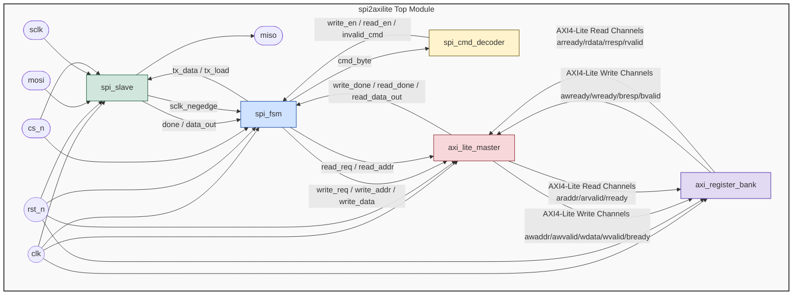

# Architecture Block Diagram

This document describes the structural block diagram of the **SPI to AXI4-Lite Bridge**. It shows how the top-level module (`spi2axilite`) encapsulates and connects the modular submodules.

## System Architecture

## Submodule Descriptions

### 1. `spi_slave`
Handles physical level SPI byte transfer. It double-synchronizes external lines (`mosi`, `sclk`, `cs_n`) to prevent metastability, counts bit boundaries, shift-stores incoming bytes, and drives the `miso` line on `sclk` falling edges.

### 2. `spi_cmd_decoder`
Decodes the first byte received in a transaction to determine if the operation is a Write (`8'h01`), Read (`8'h02`), or an invalid operation.

### 3. `spi_fsm`
The core state machine. It orchestrates the flow of reading bytes from the SPI physical interface, decoding commands, invoking the AXI master for register access, and setting up read responses.

### 4. `axi_lite_master`
Translates internal read/write request signals into compliant, standard-conforming AXI4-Lite transactions. It utilizes a separate dedicated state machine to prevent deadlocks and ensure correct handshaking.

### 5. `axi_register_bank`
A standard AXI4-Lite slave IP block containing four registers: Control, Status, Data0, and Data1. It reads or writes data based on standard AXI address channels and issues responses.
