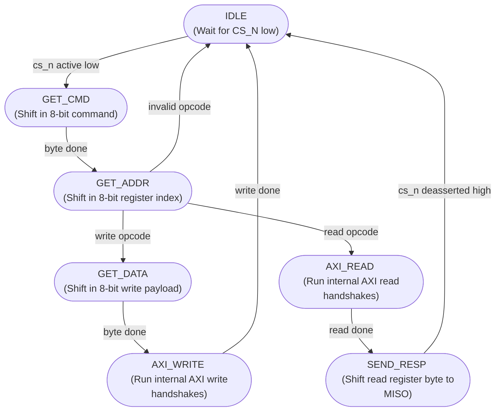

# Finite State Machine (FSM) Diagram

This document presents the Finite State Machine (FSM) controller transitions implemented inside `spi_fsm.v`.

---

## FSM State Transition Flowchart

The flowchart below shows all valid transitions and operations of the 7-state controller.

---

## State Operational Summary

* **IDLE:** Waits for Chip Select (`cs_n`) to be pulled low by the external master.
* **GET_CMD:** Shifts in the first 8 serial bits on MOSI to capture the instruction byte.
* **GET_ADDR:** Shifts in the second 8 serial bits to capture the target register address. Decodes write or read request.
* **GET_DATA:** Shifts in the third 8 serial bits (write payload).
* **AXI_WRITE:** Initiates parallel `awvalid`/`awready` and `wvalid`/`wready` handshakes to write data to the target register.
* **AXI_READ:** Initiates parallel `arvalid`/`arready` and `rvalid`/`rready` handshakes to read data from the target register.
* **SEND_RESP:** Loads the read data into the SPI shift register, serially driving MISO back to the external master.
* **CS_N Guard:** If `cs_n` goes high in any active state, the FSM instantly resets to **IDLE** in exactly one system clock cycle.
