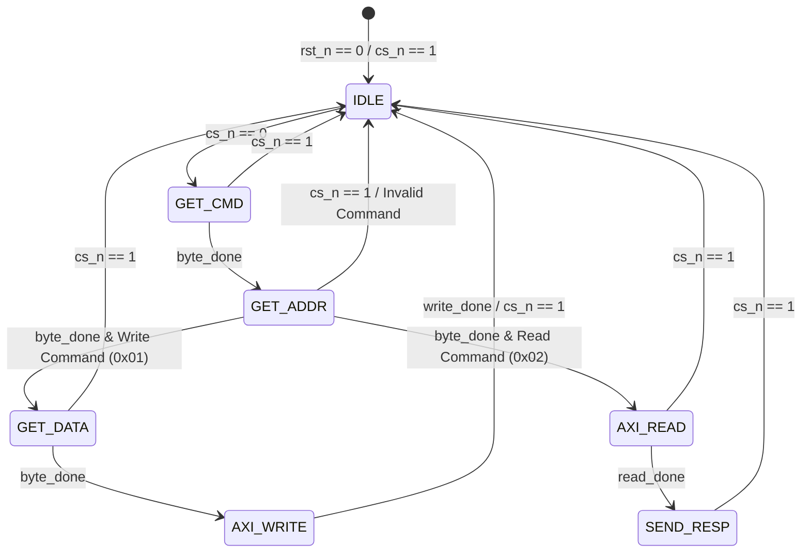

# FSM State Machine Diagram

This document details the Finite State Machine (FSM) implemented in `spi_fsm.v`. This state machine orchestrates the entire bridge behavior.

## State Transition Diagram

## State Descriptions

### 1. `IDLE` (3'd0)
* **Description**: System is idle and waiting for active communication.
* **Transition**: When `cs_n` is asserted (goes low), FSM clears registers and enters `GET_CMD`.

### 2. `GET_CMD` (3'd1)
* **Description**: Receives the first 8-bit byte containing the instruction command.
* **Transition**: Waits for `done` from the SPI receiver. Once received, it stores the command and moves to `GET_ADDR`. If `cs_n` goes high, it resets to `IDLE`.

### 3. `GET_ADDR` (3'd2)
* **Description**: Receives the second 8-bit byte representing the register target address.
* **Transition**: Once the byte is fully shifted in (`done` goes high), the address is stored. 
  - If the command was `8'h01` (WRITE), it moves to `GET_DATA`.
  - If the command was `8'h02` (READ), it moves to `AXI_READ`.
  - If the command was invalid, it resets to `IDLE`.

### 4. `GET_DATA` (3'd3)
* **Description**: For Write transactions only. Receives the third 8-bit byte containing the data payload.
* **Transition**: Once `done` goes high, the data is captured, and the FSM moves to `AXI_WRITE`.

### 5. `AXI_WRITE` (3'd4)
* **Description**: Triggers the AXI Master to execute an AXI4-Lite Write transaction to write the 8-bit data into the 32-bit register map.
* **Transition**: Asserts `write_req` high and waits for `write_done`. Once completed, it returns to `IDLE`.

### 6. `AXI_READ` (3'd5)
* **Description**: Triggers the AXI Master to execute an AXI4-Lite Read transaction to pull data from the mapped address in the register bank.
* **Transition**: Asserts `read_req` high and waits for `read_done`. Once completed, it captures the register contents and moves to `SEND_RESP`.

### 7. `SEND_RESP` (3'd6)
* **Description**: Transmits the captured register data back to the SPI Master.
* **Transition**: Upon entering this state, the FSM triggers `tx_load` on the first falling edge of `sclk` to preload the transmit shifter of `spi_slave` with the read byte. It then stays in this state while MISO shifts out the data bit-by-bit until `cs_n` is deasserted (goes high), returning the FSM to `IDLE`.

---

## State Recovery
At any point in any state, if `cs_n` goes high (active-low chip select is deasserted), the state machine synchronously resets back to `IDLE` within a single system clock cycle. This guarantees clean protocol recovery and prevents the FSM from locking up under unexpected host aborts.
