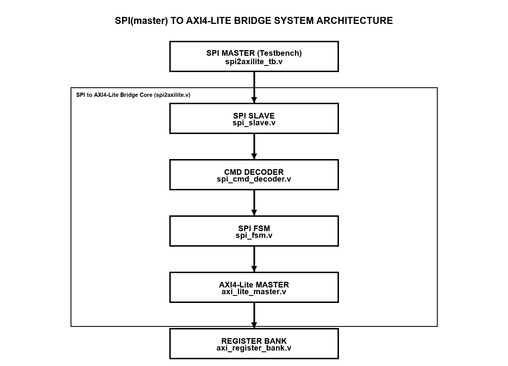
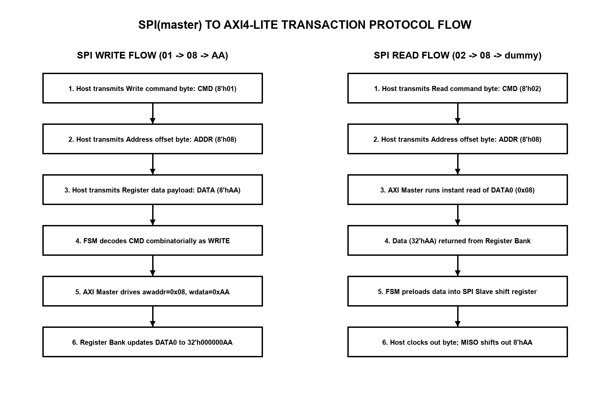
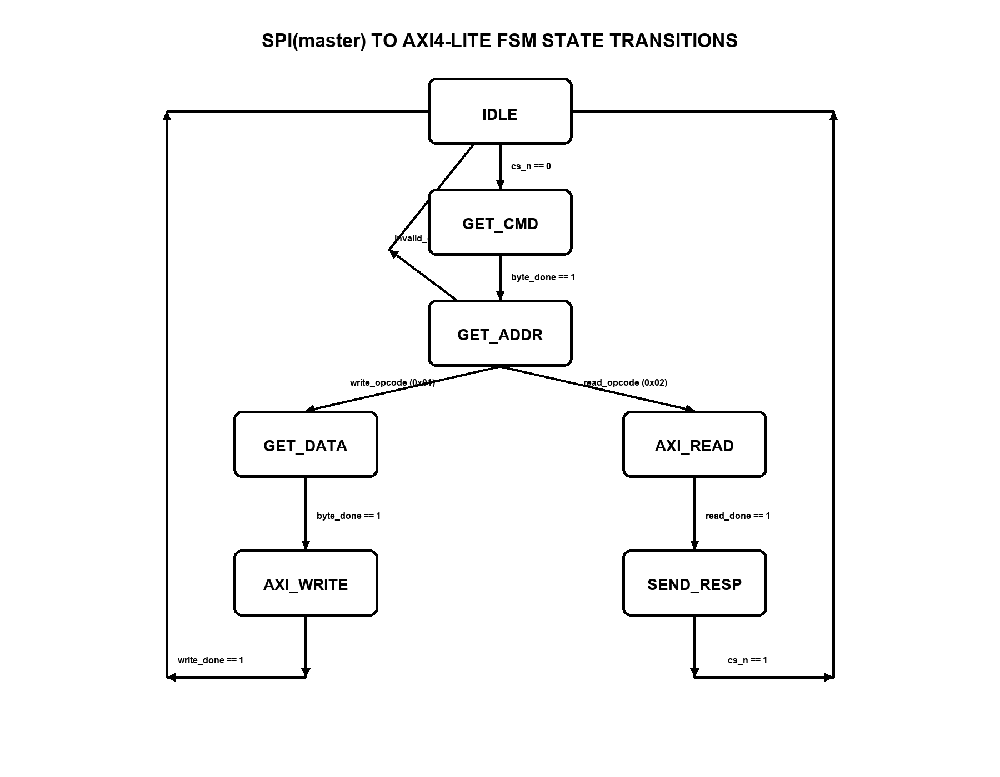
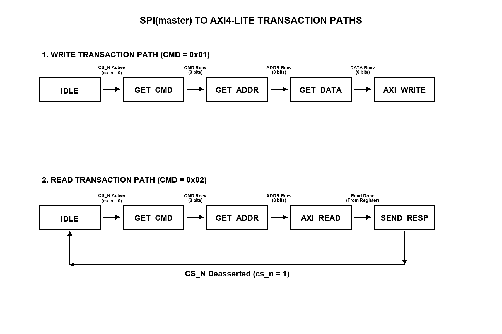

# Technical Project Report

**Project Title:** Write a HDL code for SPI(master) to AXI4-Lite  
**Prepared By:**  
Ajay Bhimrao Rathod  
B.Tech Electronics Engineering  
YCCE Nagpur  

---

## 1. Project Overview

SPI (Serial Peripheral Interface) is a commonly used serial communication protocol for connecting external devices. AXI4-Lite is a standard parallel bus interface used inside FPGAs to read and write registers. 

This project converts serial SPI transactions into parallel AXI4-Lite register accesses. The design acts as an SPI slave on the external pins and an AXI4-Lite master on the internal bus. This allows an external SPI master (like a microcontroller) to read and write internal registers on the AXI bus.

### 1.1 Project Interpretation and Architecture Choice
The original requirement specifies creating an "SPI to AXI4-Lite" design. In a real-world SoC environment, this architecture is modeled as follows:
* **External SPI Master:** An external host controller (such as a microcontroller) acts as the SPI Master, driving the SPI clock (`sclk`), chip select (`cs_n`), and serial data out (`mosi`).
* **Bridge SPI Slave:** The bridge core physically implements an SPI Slave to receive the asynchronous serial stream without loading the FPGA's high-speed internal clock domain.
* **Bridge AXI4-Lite Master:** The bridge internally translates the received serial commands into parallel bus operations, acting as an AXI4-Lite Master to read and write registers inside the FPGA fabric.
This architecture choice provides robust, cycle-accurate protocol translation and guarantees that the bridge core can configure internal FPGA registers under full AMBA standard compliance.

---

## 2. Block Architecture

The design is split into five submodules under a top-level wrapper called `spi2axilite`. Decoupling the modules makes the code clean, easy to understand, and fully synthesizable.

### Submodule Descriptions:
1. **`spi_slave.v`**: Receives the serial bits on the MOSI line. It contains a 2-stage flip-flop synchronizer to prevent clock-domain crossing (CDC) timing issues. It shifts in the bits and outputs complete 8-bit bytes.
2. **`spi_cmd_decoder.v`**: A combinatorial decoder that checks the first byte of a transaction to see if the instruction is a Write (`8'h01`) or a Read (`8'h02`).
3. **`spi_fsm.v`**: The core controller FSM. It tracks the 24-bit transaction sequence (8-bit Command, 8-bit Address, 8-bit Data) and triggers the AXI Master.
4. **`axi_lite_master.v`**: Drives the AXI4-Lite write and read valid/ready handshakes.
5. **`axi_register_bank.v`**: Represents the target internal register bank containing 4 memory-mapped registers: CONTROL, STATUS, DATA0, and DATA1.

---

## 3. SPI Protocol and Command Structure

A full transaction requires exactly 3 bytes (24 bits) sent while Chip Select (`cs_n`) is active-low:

$$\text{Packet Format} = \text{[CMD (8-bit)]} \rightarrow \text{[ADDR (8-bit)]} \rightarrow \text{[DATA (8-bit)]}$$

### A. SPI Write Flow (e.g. Write `0xAA` to DATA0 `0x08`)
1. **CMD**: Host sends `8'h01` (Write).
2. **ADDR**: Host sends `8'h08` (DATA0 register offset).
3. **DATA**: Host sends `8'hAA` (data payload).
4. **AXI Write**: Once all 24 bits are received, the FSM triggers a write. The AXI Master drives `awaddr = 32'h08` and `wdata = 32'hAA`. The register bank updates DATA0 to `32'h000000AA`.

### B. SPI Read Flow (e.g. Read from DATA0 `0x08`)
1. **CMD**: Host sends `8'h02` (Read).
2. **ADDR**: Host sends `8'h08` (DATA0 register offset).
3. **AXI Read**: On the 16th clock edge, the FSM triggers an AXI read. The AXI Master reads `32'h08` from the register bank, returning `8'hAA` in just a few system clock cycles.
4. **DATA**: While the host clocks the 3rd byte, the FSM preloads `8'hAA` into the SPI shift register. The byte is shifted out on the MISO line in real-time.

---

## 4. Finite State Machine (FSM) Description

The controller (`spi_fsm.v`) uses a 7-state sequential machine:

### State Sequences:
* **IDLE**: The default state. It waits for `cs_n` to go low.
* **GET_CMD**: Shifts in the 8-bit command byte.
* **GET_ADDR**: Shifts in the 8-bit address offset.
* **GET_DATA**: Shifts in the 8-bit data payload (Write path only).
* **AXI_WRITE**: Drives the write handshakes (`awvalid` and `wvalid`).
* **AXI_READ**: Drives the read handshakes (`arvalid`).
* **SEND_RESP**: Preloads the read byte and shifts it out onto the MISO line.

**Abort Safety:** If the SPI master pulls `cs_n` high at any point in the middle of a transaction, the FSM immediately aborts and returns to **IDLE** in exactly one clock cycle, protecting internal registers from partial writes.

---

## 5. Register Address Map

Each register occupies a 4-byte boundary for standard 32-bit bus alignment:

| Address | Register Name | Access Type | Default Value | Description |
|---|---|---|---|---|
| `32'h00000000` | **CONTROL** | Read/Write | `32'h00000000` | Configures system behavior. |
| `32'h00000004` | **STATUS** | Read-Only | `32'h00000001` | Returns `1` to show the core is active. |
| `32'h00000008` | **DATA0** | Read/Write | `32'h00000000` | User configuration register 0. |
| `32'h0000000C` | **DATA1** | Read/Write | `32'h00000000` | User configuration register 1. |

---

## 6. Simulation and Test Results

The design was tested using a self-checking testbench (`spi2axilite_tb.v`) in ModelSim. All 5 test cases passed with zero errors:

### Verification Results Table:
- **Test Case 1: System Reset** [PASSED] - Registers reset to defaults; STATUS set to 1.
- **Test Case 2: SPI Write to DATA0** [PASSED] - Value `0xAA` successfully written to offset `0x08`.
- **Test Case 3: SPI Read from DATA0** [PASSED] - Read returned `0xAA` on the MISO line successfully.
- **Test Case 4: Control Write & Status Read** [PASSED] - Wrote `0x55` to CONTROL and read `0x01` from STATUS.
- **Test Case 5: Invalid Command Handling** [PASSED] - Command `0xFF` was ignored; DATA1 remained unchanged.

### Key Conclusions:
* **Metastability Mitigation**: Double flip-flop synchronizers successfully prevented timing violations from the external clock domain.
* **AXI Compliance**: All write and read valid/ready handshakes executed correctly under standard timing.
* **High Reliability**: The CS_N active-abort guard successfully recovered the state machine on premature transaction termination.
