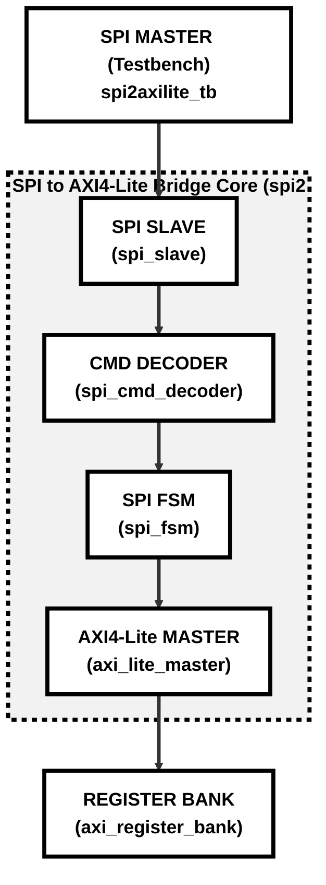

# Technical Block Architecture Diagram

This document presents the high-level structural block diagram of the synthesizable **SPI to AXI4-Lite Bridge** design.

---

## 1. System Block Diagram

This diagram outlines the sequential hardware translation hierarchy, showing the data path from the external SPI Host (Testbench) to the internal register space.

---

## 2. Hardware Submodules Overview

The entire bridge design is implemented using a modular, clean Verilog architecture. Each block performs a dedicated, specialized hardware role:

### 1. `spi_slave`
The physical interface receiver that samples the serial `mosi` line on the rising edge of `sclk`, shifts in bits, and outputs complete 8-bit parallel bytes. It also synchronizes incoming asynchronous control lines.

### 2. `spi_cmd_decoder`
A combinatorial decoder block that parses the received command byte to detect write (`8'h01`), read (`8'h02`), or invalid operations, outputting immediate command flag indicators.

### 3. `spi_fsm`
The sequential controller containing the 7-state finite state machine. It manages the byte-boundary transitions and coordinates when to trigger the internal AXI transaction.

### 4. `axi_lite_master`
The parallel bus driver that initiates standard AXI4-Lite address and data write/read handshake sequences with the slave storage bank.

### 5. `axi_register_bank`
The standard register storage space mapped inside the SoC, holding the four primary registers (CONTROL, STATUS, DATA0, DATA1) and processing writes/reads over internal bus channels.
