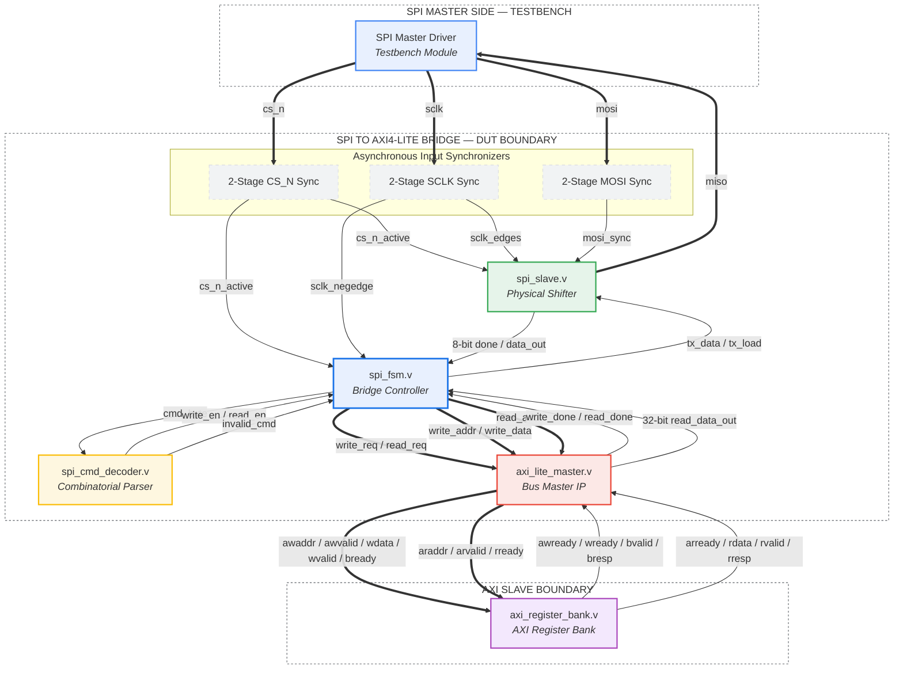

# Hardware Architecture Block Diagram

This document contains a presentation-ready, high-resolution visual mapping of the **SPI to AXI4-Lite Bridge** hardware architecture. It illustrates signal boundaries, module interfaces, and clock domains.

---

## 1. System Block Diagram

---

## 2. Key Architectural Dividers

### 🟢 SPI Slave (Physical Domain)
- **Metastability Mitigation**: Contains double flip-flop synchronizers for incoming pins.
- **Bit Shifter**: Dynamically counts clock cycles and aggregates 8-bit registers from `mosi`.

### 🟡 Command Decoder (Logic Domain)
- **Zero-Latency parsing**: Evaluates commands combinatorially to determine Write (`8'h01`), Read (`8'h02`), or Error state instantly.

### 🔵 FSM Controller (Orchestrator)
- **Synchronous System Controller**: Handles clock boundaries and triggers sub-buses synchronously to `clk`.

### 🔴 AXI4-Lite Master (Bus Domain)
- **Stateful Bus Generator**: Safely translates single-cycle FSM triggers into fully compliant 5-channel AXI handshake sequences.

### 🟣 Register Bank (Storage Domain)
- **Register Map**: Direct register-mapped address space (`CONTROL`, `STATUS`, `DATA0`, `DATA1`) returning active handshakes.
