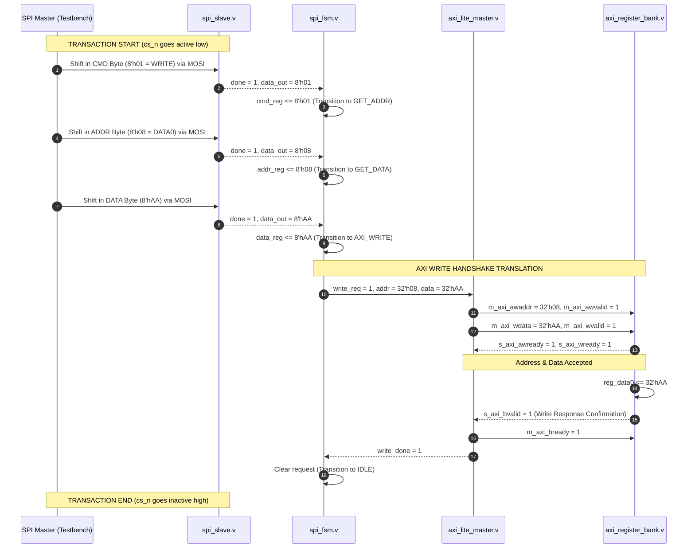
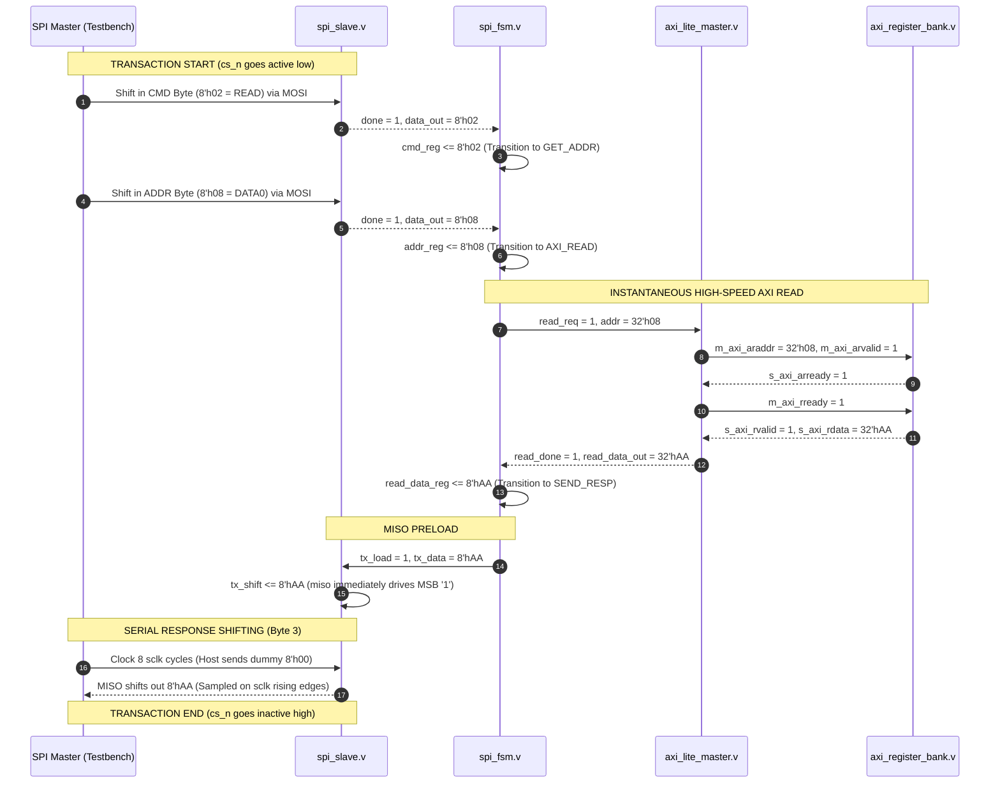

# Protocol Flow & Sequence Diagrams

This document visualizes the exact sequence of events during **SPI Write** and **SPI Read** transactions, mapping the serial bits to their parallel AXI handshakes.

---

## 1. SPI Write Transaction Sequence (Write `0xAA` to DATA0 `0x08`)

The diagram below shows the chronologically ordered sequence of operations, from the first serial bit shifting in to the final AXI confirmation.

---

## 2. SPI Read Transaction Sequence (Read DATA0 `0x08` returning `0xAA` on MISO)

The diagram below shows the read sequence. Notice how high-speed AXI reads are performed in the middle of the SPI cycle, making data ready for MISO in real-time.

