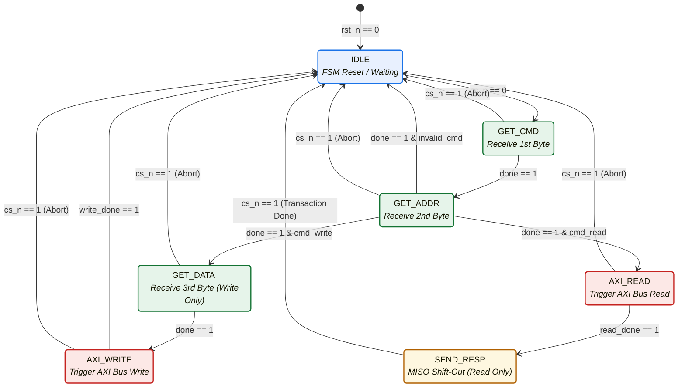

# Step-by-Step Transaction & FSM Flow

This document details the exact **Step-by-Step Transaction Flow** and provides a presentation-ready **FSM Flowchart** designed for Zoho technical presentations.

---

## 1. Step-by-Step Transaction Execution

To explain the bridge's operation in a technical review, trace this exact 7-step sequence:

```
[1] Host drives CS_N Low & Clock toggles
                    ↓
[2] Byte 1 (CMD) is shifted into SPI Slave
                    ↓
[3] FSM decodes the CMD via Decoder
       ├─ WRITE Command (0x01) ──► Receive Byte 2 (ADDR) ──► Receive Byte 3 (DATA) ──► [4] Trigger AXI Write
       └─ READ Command (0x02) ───► Receive Byte 2 (ADDR) ────────────────────────────► [5] Trigger AXI Read
                    ↓
[6] AXI Master executes compliant Handshake (aw/w/b or ar/r)
                    ↓
[7] Register map updated (for Write) OR Data loaded into SPI Shifter (for Read)
```

1. **Transaction Initialization**: The SPI Master asserts `cs_n` low. The SPI Clock (`sclk`) begins toggling.
2. **Byte 1 (Command Capture)**: The SPI Slave shifts in the first 8 bits from `mosi`. At the 8th rising edge, `done` pulses, and `spi_fsm` captures the `CMD` byte.
3. **Command Decoding**: The FSM routes `CMD` to the combinatorial `spi_cmd_decoder`.
   - **WRITE (`8'h01`)**: FSM moves to `GET_ADDR` to wait for address, then to `GET_DATA` to wait for data.
   - **READ (`8'h02`)**: FSM moves to `GET_ADDR` to wait for address, then triggers AXI Read.
4. **Byte 2 (Address Capture)**: The SPI Slave shifts in `ADDR` (e.g. `8'h08` = `DATA0`).
5. **Byte 3 (Data Capture or Response)**:
   - For **WRITE**, the slave shifts in the `DATA` payload (e.g. `8'hAA`).
   - For **READ**, the AXI master performs a high-speed read to fetch `DATA` (`8'hAA`), preloads it into `tx_shift`, and shifts it out onto MISO bit-by-bit in real-time.
6. **AXI Master Handshake**: The AXI Master generates the valid-ready transitions synchronously to `clk`, ensuring AMBA compliance.
7. **Deselect**: The SPI Master deasserts `cs_n` high. The FSM synchronously returns to `IDLE`.

---

## 2. Finite State Machine (FSM) Flowchart

This flowchart visualizes the FSM state changes and recovery paths inside `spi_fsm.v`:



---

## 3. Presentation Script Flow (Animated Feel)

When presenting this flowchart, click or step through the nodes to demonstrate the active data paths:

* *"Initially, we are in **IDLE** waiting for the Host. When **CS_N goes low** [1], we transition immediately to **GET_CMD**..."*
* *"As soon as the 8th bit is shifted on MOSI [2], the FSM enters **GET_ADDR**..."*
* *"At the 16th rising edge [3], the Command Decoder determines the data path: if it is a Write, we move to **GET_DATA**; if it is a Read, we transition to **AXI_READ** to fetch the register data at 100MHz, and immediately preload the MISO driver in **SEND_RESP**..."*
* *"At the end of the transaction, **CS_N goes high** [4], resetting the entire system back to **IDLE** in exactly one clock cycle, ensuring zero protocol hang-ups."*
