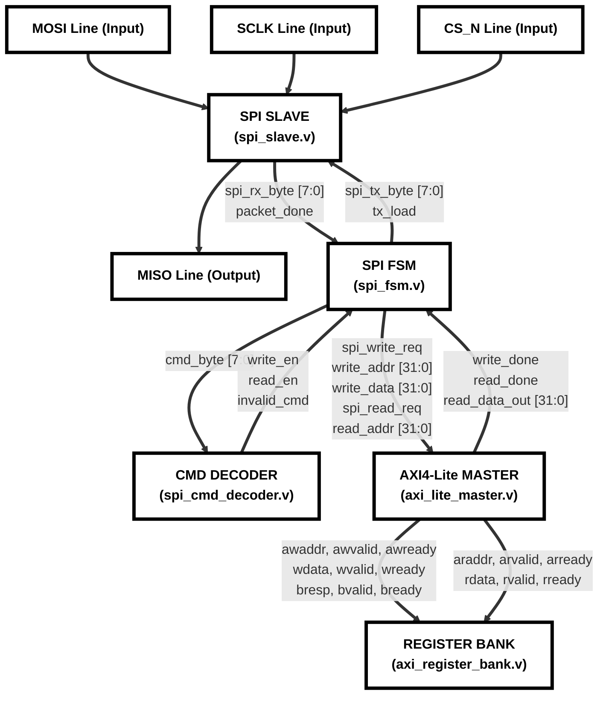
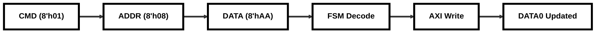
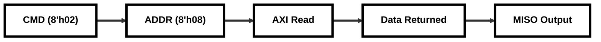

# Detailed Signal & Transaction Flow Diagram

This document presents the detailed signal routing connections and operational transaction flows of the SPI to AXI4-Lite Bridge.

---

## 1. Hardware Signal Connection Flow

The block diagram below maps the internal wire connections and physical port mappings between the submodules.

---

## 2. SPI Transaction Stage Flow

### 🔴 SPI Write Flow Sequence
This sequence outlines the data path for a write operation, such as writing `8'hAA` to register address `8'h08` (DATA0).

* **Step 1:** Host shifts `8'h01` (Write command) onto `mosi`.
* **Step 2:** Host shifts `8'h08` (DATA0 register address index) onto `mosi`.
* **Step 3:** Host shifts `8'hAA` (payload byte) onto `mosi`.
* **Step 4:** FSM decodes the write request and captures address and data.
* **Step 5:** Master starts internal AXI Write handshakes on the register bank.
* **Step 6:** AXI register bank registers `32'h000000AA` into DATA0.

---

### 🔵 SPI Read Flow Sequence
This sequence outlines the data path for a read operation, such as reading back register `8'h08` (DATA0).

* **Step 1:** Host shifts `8'h02` (Read command) onto `mosi`.
* **Step 2:** Host shifts `8'h08` (DATA0 register address index) onto `mosi`.
* **Step 3:** FSM triggers internal AXI Read on the target register.
* **Step 4:** Register bank drives data `32'h000000AA` onto parallel bus; Master captures it.
* **Step 5:** FSM loads the byte into the SPI transmitter, and the slave serially shifts out `8'hAA` on MISO.
